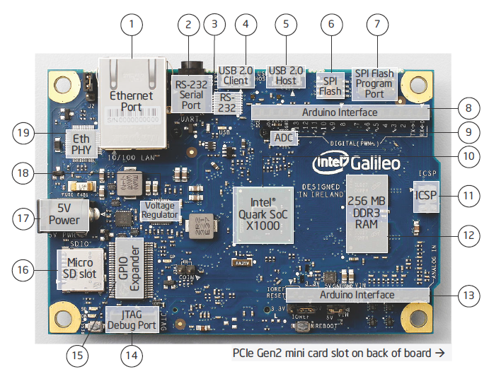
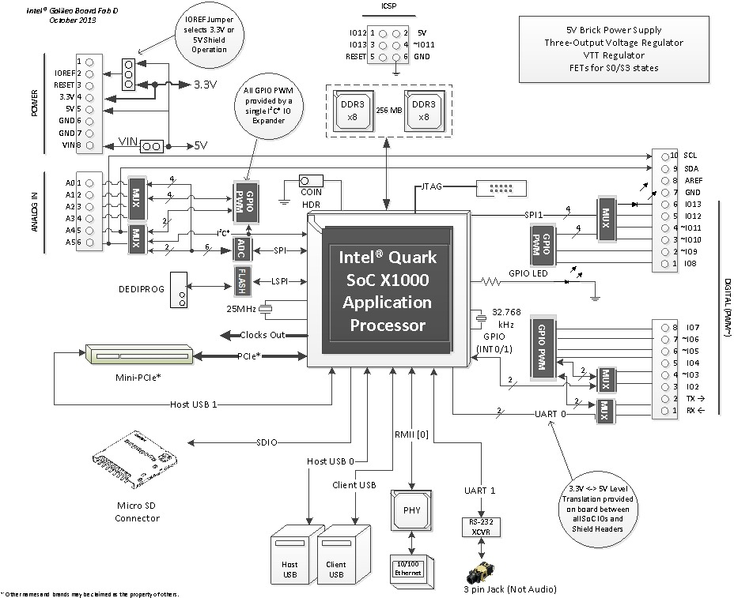

# Galileo-Engenharia-Reversa-de-BIOS
Este é um repositório de um projeto de desafio com o objetivo de realizar engenharia reversa em uma placa Intel Galileo Gen 2.

## Descrição geral da placa

A Intel Galileo é uma placa de desenvolvimento que combina a pinagem padrão do Arduino com um processador baseado na arquitetura Intel. A placa utiliza o Intel Quark SoC X1000, um processador projetado para aplicações que demandam baixo consumo de energia e desempenho eficiente. Este processador é voltado para sistemas embarcados, proporcionando uma alternativa àquelas baseadas em microcontroladores mais tradicionais, como os usados em plataformas Arduino.

A Intel Galileo é compatível com shields Arduino e utiliza o ambiente de desenvolvimento Arduino IDE (Integrated Development Environment), além de ser compatível com as bibliotecas de código aberto do Arduino. A placa de desenvolvimento opera com o sistema operacional Linux, que já vem pré-instalado e configurado, incluindo as bibliotecas de software do Arduino. Isso permite a utilização de recursos e funcionalidades desenvolvidas para o padrão Arduino. A Intel Galileo pode ser programada a partir de qualquer computador com sistemas operacionais Windows, Mac ou Linux via conexão USB.

De maneira simplificada, a Intel Galileo pode ser descrita como uma placa que possui um sistema Linux mínimo e um simulador de Arduino UNO R3 por software, oferecendo um desempenho significativamente superior. A distribuição Linux instalada na placa é a Poky 9.0.2, baseada no Yocto Project 1.4 Reference Distro. Além disso, é possível instalar uma distribuição Linux em um cartão SD externo, permitindo a inicialização da placa com suporte a diversos módulos externos, que podem ser conectados aos barramentos adicionais disponíveis na placa.

O Intel Quark SoC X1000, o primeiro processador da família Quark, possui uma arquitetura de 32 bits, é single core e single thread, e é compatível com o conjunto de instruções Pentium (ISA). Isso garante que seja binariamente compatível com programas Linux compilados para sistemas x86 de 32 bits, sem a necessidade de cross-compilação. O processador opera a uma frequência de até 400 MHz.

## Estrutura da Placa

Abaixo segue a lista da estrutura geral da placa:

1. Processador e Arquitetura

- Processador: Intel Quark SoC X1000
- Arquitetura x86 (32 bits).
- Single-core e single-thread.
- Frequência de até 400 MHz.
- Cache L1: 32 KB (dividido entre dados e instruções).
- Cache L2: 512 KB.
- Instrução compatível com o set Pentium (ISA): Permite que programas Linux compilados para sistemas x86 de 32 bits sejam executados sem a necessidade de cross-compilação.
2. Memória

- Memória RAM: 256 MB DDR3.
- Memória Flash: 8 MB SPI Flash.
- Armazenamento do sistema operacional e firmware.

3. Conectividade

- Ethernet: 1 porta RJ45 10/100 Mbps para comunicação de rede.
- USB 2.0:
- 1 porta USB host (para conectar periféricos, como teclados, mouses, etc.).
- 1 porta USB device (para comunicação com o PC para programação e depuração).
- HDMI: 1 porta HDMI para saída de vídeo digital, permitindo a conexão com monitores ou displays.
- Serial (UART): 1 porta UART para comunicação serial com dispositivos externos.

4. Barramentos e Interfaces

- GPIO (Pinos de Entrada/Saída Digital):
- 20 pinos digitais (configuráveis como entradas ou saídas).
- Funções adicionais: Alguns pinos também suportam PWM, interrupções externas e comunicação serial.
- I2C (Inter-Integrated Circuit):
- 2 barramentos I2C (com até 128 dispositivos endereçáveis em cada barramento).
- Utilizado para comunicação com sensores e outros dispositivos periféricos.
- SPI (Serial Peripheral Interface):
- 2 barramentos SPI para comunicação de alta velocidade com dispositivos periféricos.
- PWM (Pulse Width Modulation):
- Suporte para vários pinos PWM para controle de dispositivos como motores e LEDs.

5. Armazenamento

- Cartão SD: Suporte para cartão SD para armazenamento adicional e carregamento de sistemas operacionais alternativos.
- Sistema operacional Linux: A placa vem com a distribuição Poky 9.0.2 (baseada no Yocto Project 1.4), que é um sistema Linux configurado para ser usado em sistemas embarcados.

6. Fonte de Alimentação

- Entrada de Alimentação:

    - Micro-USB: Para alimentação de 5V DC.
    - Barrel Jack: Entrada de 7 a 15V DC para fontes de alimentação externas.

- Fonte Interna:
    - A placa possui reguladores de tensão internos que convertem a entrada de 5V ou 12V para 3.3V e 5V necessários para os componentes internos.

7. Relógio de Tempo Real (RTC)

RTC (Real-Time Clock): Chip de relógio de tempo real, que mantém a hora e data mesmo quando a placa está desligada (com suporte a bateria CR2032 para manter o horário).

8. Software e Desenvolvimento

- Ambiente de Desenvolvimento:
Arduino IDE (Integrated Development Environment) para programação da placa com compatibilidade total com shields Arduino e bibliotecas do Arduino.

- Sistema Operacional:

    - Linux: A placa executa uma versão minimalista do sistema operacional Linux (Poky 9.0.2), com suporte a pacotes adicionais instalados via cartão SD ou USB.
    - Bibliotecas de Software: A placa oferece as bibliotecas Arduino para facilitar a programação e integração com diversos componentes eletrônicos.

9. Expansão

- Conector de Expansão Arduino:
Compatível com shields Arduino do tipo UNO, permitindo a expansão de funcionalidades com sensores, atuadores, módulos de comunicação, entre outros.

10. Áudio e Gráficos

- Áudio: A placa possui um controlador de áudio integrado, mas a saída normalmente é feita por meio da HDMI.
- Vídeo: A placa suporta HDMI para saída de vídeo digital, permitindo a conexão com monitores ou displays HDMI.

11. LEDs e Botões

- LEDs:

    - Indicadores de status (alimentação, comunicação e operação).
    - LEDs de status de rede e ativação de portas (Ethernet, USB, etc.).

- Botões:

    - Botão de reset para reiniciar a placa.
    - Botão de boot para iniciar o processo de inicialização ou recuperação do sistema.

12. Dimensões e Layout

- Dimensões da placa: Aproximadamente 10,16 cm x 6,35 cm.
- Peso: Cerca de 75 gramas.
- Conector de pinos (headers): Compatível com shields do padrão Arduino, permitindo a inserção direta de módulos de expansão.

## Funcionalidades e Recursos

- Padrão Arduino UNO R3: Totalmente compatível com shields Arduino, facilitando a integração com uma ampla gama de módulos e sensores.
- Arduino IDE: Suporte completo ao ambiente de desenvolvimento Arduino IDE para programar em Windows, macOS e Linux.
- RTC (Relógio de Tempo Real): Inclui um RTC integrado com suporte a bateria externa (3V), permitindo o controle de tempo, mesmo quando a placa estiver desligada.
- Entradas e Saídas (GPIO): Possui suporte a pinos de entrada e saída digitais, com controle aprimorado de corrente e maior precisão.
- PWM (Pulse Width Modulation): Controle de PWM de 12 bits, oferecendo maior precisão no controle de dispositivos externos como motores e LEDs.
- JTAG: Para depuração e testes em tempo real.
- Console UART para Debug: Conector de UART disponível para facilitar o uso de conversores USB para depuração do sistema.
- Acesso ao Sistema Operacional: Acesso total ao sistema operacional Linux, permitindo o uso de softwares como Python, Node.js, e outras aplicações baseadas em Linux.
- Expansão de Hardware: Facilita a criação de protótipos e projetos com recursos adicionais como sensores, displays e dispositivos de controle via interfaces I2C, SPI, UART, etc.

## Diagramas

